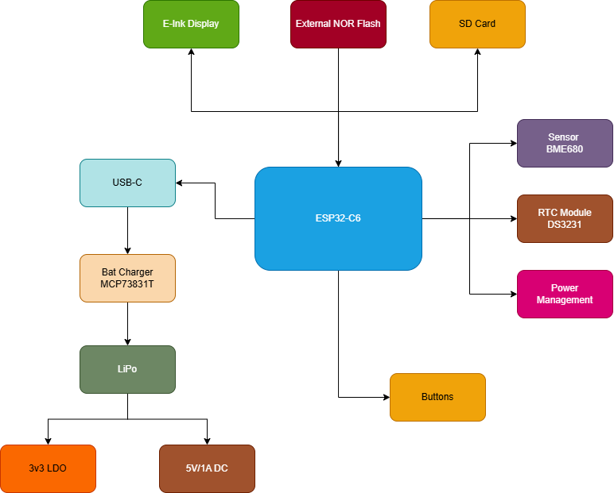
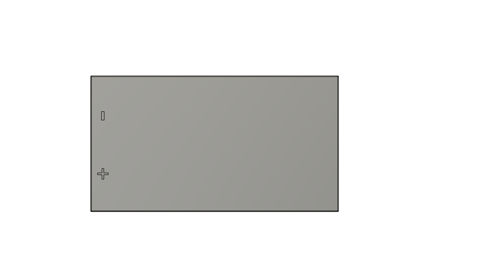

# OpenBook

## Project Overview
OpenBook is an open-source e-book reader designed to be cost-effective and accessible. The goal of this project is to develop the hardware required for mass production based on system architecture specifications. This includes designing the schematic, PCB layout, and 3D models necessary for the device.


## Repository Structure
```
- Hardware
  |-- schematic (.sch)
  |-- PCB layout (.brd)
- Manufacturing
  |-- gerbers.zip
  |-- Bill of Materials
  |-- Pick and Place file
- Mechanical
  |-- 3D model of the device (.step)
  |-- Fusion360 file of the complete device
- Images
  |-- Rendered images of the PCB and device
- LICENSE
- README.md
```

## Hardware Overview
### Block Diagram


# Bill of Materials (BOM)

| 🔩 Component                                        | 🔗 Link                | 📄 Datasheet                        |
|--------------------------------------------------|-----------------------------------|-----------------------------------|
| ESP32-C6 WROOM-1-N8                              | [SnapMagic](https://www.snapeda.com/parts/ESP32-C6-WROOM-1-N8/Espressif+Systems/view-part/?ref=eda)         | [Datasheet](https://www.snapeda.com/parts/ESP32-C6-WROOM-1-N8/Espressif%20Systems/datasheet/)     |
| ESP32C6 Varistor 1812                            | [Mouser](https://ro.mouser.com/ProductDetail/EPCOS-TDK/B72520T0350K062?qs=dEfas%2FXlABIszF52uu7vrg%3D%3D)        | [Datasheet](https://www.tdk-electronics.tdk.com/inf/75/db/CTVS_14/Surge_protection_series.pdf)     |
| ESP32 WROVER 0805 Capacitor                      | [Mouser](https://ro.mouser.com/ProductDetail/KYOCERA-AVX/SD0805S020S1R0?qs=jCA%252BPfw4LHbpkAoSnwrdjw%3D%3D)         | [Datasheet](https://ro.mouser.com/datasheet/2/40/schottky-3165252.pdf)     |
| ESP32 WROVER BME680 Sensor                       | [SnapMagic](https://www.snapeda.com/parts/BME680/Bosch/view-part/?welcome=home)        | [Datasheet](https://www.snapeda.com/parts/BME680/Bosch%20Sensortec/datasheet/)     |
| ESP32 WROVER MCP73831 Power Management           | [Mouser](https://eu.mouser.com/ProductDetail/Microchip-Technology/MCP73831T-2ACI-OT?qs=yUQqVecv4qvbBQBGbHx0Mw%3D%3D)         | [Datasheet](https://eu.mouser.com/datasheet/2/268/MCP73831_Family_Data_Sheet_DS20001984H-3441711.pdf)     || ESP32 WROVER P-Channel MOSFET                    | [Component Search Engine](https://componentsearchengine.com/part-view/DMG2305UX-7/Diodes%20Incorporated)         | [Datasheet](https://www.diodes.com//assets/Datasheets/DMG2305UX.pdf)     |
| LED Chip 0603                                    | [SnapMagic](https://www.snapeda.com/parts/KP-1608SURCK/Kingbright/view-part/?ref=search&t=LED%200603)        | [Datasheet](https://www.snapeda.com/parts/KP-1608SURCK/Kingbright/datasheet/)     |
| SJ                                               | [GrabCad](https://grabcad.com/library/solder-jumpers-1)         | [Datasheet](https://www.youtube.com/watch?v=dQw4w9WgXcQ)     |
| LTSPICE Resistor 0402                            | [Component Search Engine](https://componentsearchengine.com/part-view/R0402%201%25%20100%20K%20(RC0402FR-07100KL)/YAGEO)        | [Datasheet](https://www.yageo.com/upload/media/product/products/datasheet/rchip/PYu-RC_Group_51_RoHS_L_12.pdf)     |
| RCL CPOL 3528                                    | [SnapMagic](https://www.snapeda.com/parts/TAJB475K025RNJ/AVX/view-part/?ref=dk&t=capacitor%203528&con_ref=None)        | [Datasheet](https://s3.amazonaws.com/snapeda/datasheet/TAJB475K025RNJ_AVX.pdf)     |
| 112A-TAAR-R03                                    | [Comet](https://store.comet.srl.ro/Catalogue/Product/43497/)         | [Datasheet](https://store.comet.bg/download-file.php?id=27596)     |
| 744043680 IND                                    | [Mouser](https://eu.mouser.com/ProductDetail/Wurth-Elektronik/744043680?qs=PGXP4M47uW6VkZq%252BkzjrHA%3D%3D)        | [Datasheet](https://www.we-online.com/components/products/datasheet/744043680.pdf)     |
| BD5229G-TR                                       | [Component Search Engine](https://componentsearchengine.com/part-view/BD5229G-TR/ROHM%20Semiconductor)         | [Datasheet](https://datasheet.datasheetarchive.com/originals/distributors/Datasheets_SAMA/f2b9741ef86007909f138d561a359946.pdf)     |
| Custom Button                                    | [Panasonic](https://industry.panasonic.com/global/en/products/control/switch/light-touch/number/evqpuj02k)        | [Datasheet](https://industry.panasonic.com/global/en/downloads?tab=catalog&small_g_cd=203&part_no=EVQPUJ02K&q=RVZRUFVKMDJLJTdDMTMlN0MyMDMlN0MzNDU5JTdDMSU3QyU3QzIlN0M%3D)     |
| CPH3225A                                         | [SnapMagic](https://www.snapeda.com/parts/CPH3225A/Seiko+Instruments/view-part/?ref=eda)         | [Datasheet](https://www.snapeda.com/parts/CPH3225A/Seiko%20Instruments/datasheet/)     |
| DS3231SN RTC                                     | [SnapMagic](https://www.snapeda.com/parts/DS3231SN%23/Analog+Devices/view-part/?ref=eda)        | [Datasheet](https://www.snapeda.com/parts/DS3231SN%23/Analog%20Devices/datasheet/)     |
| FH34SRJ-24S-0.5SH Connector                      | [Component Search Engine](https://componentsearchengine.com/part-view/FH34SRJ-24S-0.5SH(99)/Hirose)        | [Datasheet](https://www.hirose.com/en/product/document?clcode=CL0580-1255-6-99&productname=FH34SRJ-24S-0.5SH(99)&series=FH34SRJ&documenttype=2DDrawing&lang=en&documentid=0000990903)     |
| MAX17048G+T10 Battery Fuel Gauge                 | [SnapMagic](https://www.snapeda.com/parts/MAX17048G+T10/Analog+Devices/view-part/?ref=eda)         | [Datasheet](https://www.snapeda.com/parts/MAX17048G+T10/Analog%20Devices/datasheet/)     |
| MBR0530 Schottky Diode                           | [SnapMagic](https://www.snapeda.com/parts/MBR0530/Onsemi/view-part/?ref=eda)        | [Datasheet](https://www.snapeda.com/parts/MBR0530/ON%20Semiconductor/datasheet/)     |
| PGB1010603MR Inductor                            | [SnapMagic](https://www.snapeda.com/parts/PGB1010603MR/Littelfuse/view-part/?ref=eda)         | [Datasheet](https://www.snapeda.com/parts/PGB1010603MR/Littelfuse%20Inc./datasheet/)     |
| QWIIC Connector                                  | [Mouser](https://eu.mouser.com/ProductDetail/Adafruit/4208?qs=PzGy0jfpSMtbScLbr0L5dw%3D%3D)        | [Datasheet](https://www.youtube.com/watch?v=dQw4w9WgXcQ)     |
| USB4110-GF-A USB Hub                             | [Component Search Engine](https://componentsearchengine.com/part-view/USB4110-GF-A/GCT%20(GLOBAL%20CONNECTOR%20TECHNOLOGY))         | [Datasheet](https://gct.co/files/drawings/usb4110.pdf)     |
| SI1308EDL-T1-GE3 MOSFET                          | [SnapMagic](https://www.snapeda.com/parts/SI1308EDL-T1-GE3/Vishay+Siliconix/view-part/?ref=eda)        | [Datasheet](https://www.youtube.com/watch?v=dQw4w9WgXcQ)     |
| TPTP20R                                          | [Comet](https://easyeda.com/component/7524403feb2642ac9f9f26dfb93ceacf)         | [Datasheet](https://easyeda.com/component/7524403feb2642ac9f9f26dfb93ceacf)     |
| USBLC6-2SC6Y USB Surge Protection                | [SnapMagic](https://www.snapeda.com/parts/USBLC6-2SC6Y/STMicroelectronics/view-part/?ref=eda)        | [Datasheet](https://www.snapeda.com/parts/USBLC6-2SC6Y/STMicroelectronics/datasheet/)     |
| W25Q512JVEIQ Flash Memory                        | [SnapMagic](https://www.snapeda.com/parts/W25Q512JVEIQ/Winbond+Electronics/view-part/?ref=eda)         | [Datasheet](https://www.snapeda.com/parts/W25Q512JVEIQ/Winbond%20Electronics/datasheet/)     |
| XC6220A331MR-G Voltage Regulator                 | [Component Search Engine](https://componentsearchengine.com/part-view/XC6220A331MR-G/Torex)        | [Datasheet](https://product.torexsemi.com/system/files/series/xc6220.pdf)     |


# Hardware Functionality Overview

## 1. Battery
- **Model:** CELLEVIA BATTERIES LP584174  
- **Specifications:** 3.7V, 1800mAh  
- **Purpose:** Powers the entire device. The Li-Po battery is managed by a dedicated charging controller, which helps extend battery lifespan and provides protection against overcharging and deep discharge.


## 2. E-Paper Display
- **Model:** 7.5” e-Paper V2  
- **Revision:** 2.0 (2019/06/28)  
- **Description:** This display offers ultra-low power consumption, making it ideal for static text rendering. It communicates via an SPI interface and is powered through a low-dropout (LDO) voltage regulator.


## 3. ESP32 C6 Microcontroller
- **Function:** Acts as the main controller, handling communication between all peripherals including the display, sensors, storage modules, and more. It also provides Wi-Fi and Bluetooth connectivity.


## 4. BME688 Environmental Sensor
- **Interface:** I2C  
- **Functionality:** Measures temperature, humidity, pressure, and air quality. These readings can influence device behavior depending on environmental conditions.

## 5. RTC Module - DS3231SN
- **Interface:** I2C  
- **Purpose:** Maintains accurate date and time even when the device is powered off. Useful for timestamping, scheduling wake-ups, or saving user progress.

## 6. Li-Po Charging Controller - MCP73831T
- **Power Source:** USB-C  
- **Function:** Safely manages the charging of the Li-Po battery. Includes features that prevent overcharging and deep discharge. The USB-C port also allows for fast charging.

## 7. SD Card Module
- **Interface:** SPI  
- **Purpose:** Enables external file storage, such as e-books. It is essential for managing and accessing reading materials.

## 8. External NOR Flash (64MB)
- **Interface:** SPI  
- **Usage:** Provides additional memory space for application data and firmware.

## 9. Test Pads & Qwiic/Stemma QT Connectors
- **Functionality:** Test pads are used for debugging and quality control during development. The modular connectors support easy integration of sensors or peripherals over I2C or SPI.

## 10. LDO Voltage Regulator
- **Purpose:** Ensures a stable voltage supply to all hardware components, protecting them from fluctuations in input voltage.

---

## Communication Interfaces

- **GPIO:** Used for handling physical buttons such as power or reset.
- **USB-C:** Used for charging and PC connectivity.
- **I2C:** Connects components like the environmental sensor and RTC module.
- **SPI:** Used for high-speed data transfer with components like the display, SD card, and external flash.

---

# Power Consumption Overview

The following estimates reflect typical usage scenarios based on standard operating conditions.

## Battery
- **Voltage:** 3.7V  
- **Capacity:** 1800mAh  
- **Battery Life:** Varies based on power draw; under typical conditions, it can last several hours.

## ESP32 C6
- **Idle:** ~0.1mA  
- **Wi-Fi active:** ~200mA  
- **Bluetooth active:** ~150mA  
- **Max load:** ~350mA  
- **Estimated average:** 150mA

## E-Paper Display
- **Consumption during refresh:** 30–50mA  
- **Estimated average:** 40mA with infrequent updates

## BME688 Sensor
- **Typical draw:** 2mA

## DS3231SN RTC Module
- **Estimated draw:** 2mA

## MCP73831T Charger
- **Consumption during idle:** Negligible

## SD Card
- **Typical draw:** 10–15mA  
- **Estimated average:** 12mA

## NOR Flash
- **Active usage:** 20–30mA  
- **Estimated average:** 25mA

---

## Estimated Total Consumption (Typical Use)

| Component              | Current Draw (mA) |
|------------------------|-------------------|
| ESP32 (Wi-Fi active)   | 200mA             |
| E-Paper Display        | 40mA              |
| BME688 Sensor          | 2mA               |
| RTC Module             | 2mA               |
| SD Card                | 12mA              |
| NOR Flash              | 25mA              |
| **Total**              | **281mA**         |

---

## Battery Life Estimate

To estimate battery life:

 - Battery Life = Battery Capacity / Average Current Draw
 - Battery Life = 1800mAh / 281mA ≈ 6.41 hours

 ### Important Notes:
This estimate assumes continuous operation with Wi-Fi enabled, periodic display refreshes, and sensor readings. In practical use, battery life can be significantly extended through:

- Low-power sleep modes on the ESP32  
- Reducing display update frequency  
- Disabling unused modules or interfaces 

# ESP32-C6 Pin Usage Breakdown

This section outlines the pin configuration used in the current hardware design based on the ESP32-C6 microcontroller.

## Power Connections
- **3V3 (Pin 2 & top-right corner)** – Supplies 3.3V to the microcontroller and all connected peripherals.
- **GND (bottom-right corner)** – Ground reference for the entire system.

## Boot and Reset
- **GPIO8 (Pin 15, IO/BOOT)** – Used to enter bootloader mode; pulled low through a 10kΩ resistor.
- **RESET (Pin 3)** – Manual reset input for restarting the microcontroller.

## SPI Interface (E-Paper Display and Flash Memory)
- **MISO (Pin 27)** – SPI Master-In Slave-Out; receives data from connected devices.
- **MOSI (Pin 10)** – SPI Master-Out Slave-In; sends data to peripherals.
- **SCK (Pin 7)** – Serial clock line for SPI communication.
- **SS_SD (Pin 4)** – Likely used as Chip Select (CS) for the SD card module.
- **EPD_CS (Pin 11)** – Chip Select for the E-Paper Display.
- **FLASH_CS (Pin 12)** – Chip Select for the external NOR Flash.

## E-Paper Display Control
- **EPD_BUSY (Pin 26)** – Indicates when the display controller is processing a command.
- **EPD_DC (Pin 5)** – Data/Command control signal for the E-Paper interface.
- **EPD_RST (Pin 21)** – Reset pin for the E-Paper controller.
- **EPD_3V3_C (Pin 19)** – Likely used to control or enable power to the E-Paper display.

## I2C Interface (RTC and Environmental Sensors)
- **SDA (Pin 20)** – Data line for I2C communication.
- **SCL (Pin 21)** – Clock line for I2C communication.
- **I2C_PW (Pin 18)** – Controls power delivery to I2C-connected devices.
- **INT_RTC (Pin 8)** – Interrupt output from the RTC module.
- **RTC_RST (Pin 16)** – Reset input for the RTC chip.

## USB Interface
- **USB_D- (Pin 13)** and **USB_D+ (Pin 14)** – Differential data lines for USB communication.

## UART Interface
- **TX (Pin 25)** – UART transmit pin used for serial output.
- **RX (Pin 24)** – UART receive pin used for serial input.

## Additional GPIOs
- **IO_CHANGE (Pin 23)** – Custom GPIO, possibly used for interrupts or status signals from external hardware.

---

### Pin Mapping Considerations

This pin configuration is chosen to balance performance and modularity:
- The SPI bus supports high-speed data exchange with both the E-Paper Display and external flash memory.
- The I2C bus is reserved for lower-speed peripherals, such as the RTC and environmental sensors.
- Dedicated control signals for the display enable precise handling of rendering operations.
- UART is available for serial debugging or external communication.
- Power, reset, and enable signals are placed for ease of access and stability in the overall system layout.


## Design Constraints
- **PCB Dimensions**: Must fit within the predefined casing
- **Power Traces**: Width = 0.3mm, Data traces = 0.15mm minimum
- **No Right-Angle Traces**: Ensure smooth signal flow
- **Decoupling Capacitors**: 100nF placed near power pins
- **ESP32 Antenna Placement**: Must be at the PCB edge, with no ground plane underneath
